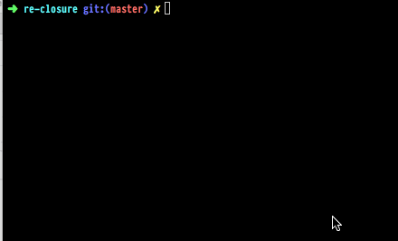

# re-closure

Okay, so we have a JavaScript string to optimize in ReasonML, so we
pass it to the closure compiler programmatically over the JNI and
OCaml ffi with help of a Java wrapper program. Yep.

# build

You might need to adjust where your Java code is at, I assume `OS X`
so you might need to adjust the `jdk1.8.0_144.jdk` in 

```
-I/Library/Java/JavaVirtualMachines/jdk1.8.0_144.jdk/Contents/Home/include
```

in the `lib/jbuild` file.

Also, assuming you have the `ReasonML` toolchain installed and jbuilder
(`opam install jbuilder -y`) and on `OS X`,
then just type `make` in the root of the project, that will run the
example invocation of closure.

# SHIT IS FRAGILE

This is a fragile POC but it could be turned into something cool.


